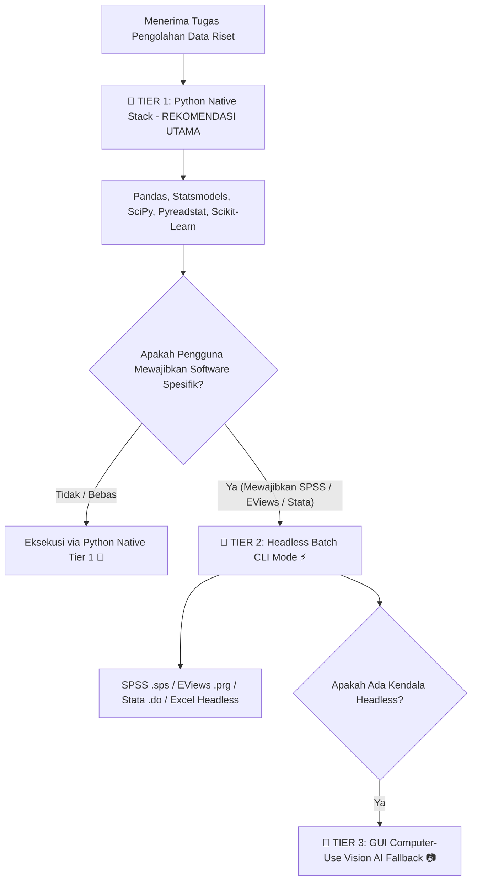

# Computer Use & Software Automation Skill (3-Tier Architecture)

## Overview
Skill ini bertanggung jawab untuk pengolahan data riset dan otomatisasi antarmuka perangkat lunak pihak ketiga (**IBM SPSS, EViews, MS Excel, Stata, RapidMiner, SmartPLS**). 

Skill ini mengadopsi **Arsitektur 3-Tier** yang memprioritaskan efisiensi, kecepatan, kebebasan lisensi open-source, dan keandalan deterministik tanpa mengganggu layar pengguna.

---

## Hierarki Rekomendasi 3-Tier (3-Tier Execution Hierarchy)



### 🥇 Tier 1: Python Native Stack (Rekomendasi Utama & Default)
- **Modul Utilitas**: `pandas`, `statsmodels`, `scipy`, `pyreadstat`, `pingouin`, `scikit-learn`.
- **Keunggulan**: 
  - 100% Gratis & Open-Source (tanpa lisensi software pihak ketiga).
  - Secara *native* mampu membaca dan menulis berkas dataset SPSS (`.sav`), Stata (`.dta`), SAS (`.sas7bdat`), dan Excel (`.xlsx`) via `pyreadstat`.
  - Menghasilkan perhitungan statistik (p-value, R-squared, t-statistic, F-statistic, regresi panel, ANOVA) yang 100% identik dengan hasil SPSS/EViews/Stata.
  - Dapat langsung di-offload ke Google Colab jika dataset berskala besar.

---

### 🥈 Tier 2: Headless Batch CLI Mode (Digunakan Jika Pengguna Mewajibkan Software Tertentu)
Jika pengguna secara khusus meminta/mewajibkan pengolahan via software tertentu:
1. **IBM SPSS Statistics (.sps)**: 
   - Eksekusi SPSS Syntax (`.sps`) di background menggunakan `stats.exe -script` tanpa membuka window SPSS GUI.
2. **EViews (.prg)**: 
   - Eksekusi EViews Program (`.prg`) atau COM Automation `win32com` (`Visible=False`) untuk regresi ekonometrika di background.
3. **Microsoft Excel (.xlsx / .vba)**: 
   - Eksekusi formula & macro VBA via `openpyxl`, `xlwings`, atau `win32com.client` (`Visible=False`).
4. **Stata (.do)**: 
   - Eksekusi do-file Stata (`stata-se -b do script.do`) dan baca output `.log` secara background.

---

### 🥉 Tier 3: GUI Computer-Use Vision AI Fallback (Pilihan Terakhir)
Hanya digunakan jika aplikasi tidak memiliki interface CLI/Batch atau pengguna membutuhkan simulasi visual interaktif:
```yaml
primary_skill: stablyai/orca@computer-use
fallback_references:
  - name: web-infra-dev/midscene-skills@computer-automation
    type: vision-based-ui
    command: npx skills add web-infra-dev/midscene-skills@computer-automation
  - name: am-will/codex-skills@gemini-computer-use
    type: gemini-optimized-schema
    command: npx skills add am-will/codex-skills@gemini-computer-use
```
- **Cara Kerja Auto-Recovery**: Jika `stablyai/orca@computer-use` mengalami kendala identifikasi elemen UI, agen secara otomatis (*on-demand*) memanggil `web-infra-dev/midscene-skills@computer-automation` (Vision-Based AI) atau `am-will/codex-skills@gemini-computer-use`.

---

## Workflow Standard

1. **Analisis Kebutuhan**: Pahami apakah pengguna membebaskan metode analisis atau mewajibkan software tertentu (SPSS/EViews/Stata/Excel).
2. **Jalankan Tier 1 (Python Native Stack)**: Secara default, gunakan Python dengan `pyreadstat` untuk membaca dataset (`.sav`/`.xlsx`/`.dta`) dan `statsmodels`/`scipy` untuk analisis.
3. **Jalankan Tier 2 (Headless Batch Mode)**: Jika software tertentu diwajibkan, susun berkas script batch (`.sps`, `.prg`, `.do`) dan eksekusi via CLI background.
4. **Jalankan Tier 3 (GUI Computer-Use Fallback)**: Jika interaksi visual interaktif diperlukan, gunakan `stablyai/orca@computer-use` dengan auto-fallback vision AI.
5. **Penyimpanan Hasil**: Simpan tabel statistik, grafik, dan log hasil pengolahan data secara rapi di direktori proyek.
