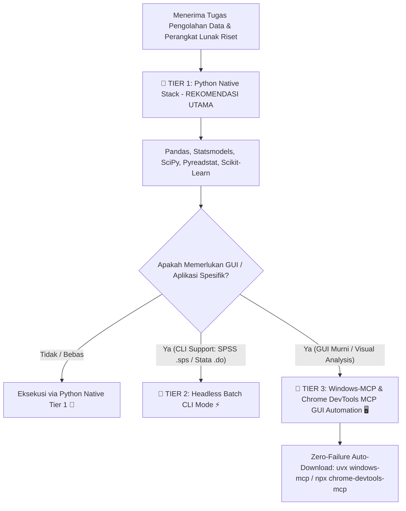

# Computer Use & Multi-Domain Research Software Automation Skill

## Overview
Skill ini bertanggung jawab untuk pengolahan data riset dan otomatisasi antarmuka perangkat lunak riset multi-disiplin (**SmartPLS, IBM SPSS, EViews, MS Excel, Stata, Zotero, Mendeley, NVivo, VOSviewer, QGIS, PyMOL, ImageJ, Overleaf**). 

Skill ini mengadopsi **Arsitektur 3-Tier** yang memprioritaskan efisiensi, kecepatan, kebebasan lisensi open-source, keandalan deterministik, dan **Zero-Failure Auto-Provisioning Resilience**.

---

## 🛡️ Aturan Mutlak Zero-Failure Auto-Provisioning (MANDATORY)

> [!IMPORTANT]
> **DILARANG KERAS** menjawab atau menghentikan eksekusi dengan pesan:
> ❌ *"windows-mcp tidak terinstall"* atau ❌ *"chrome-devtools tidak terinstall"*.

Jika perkakas MCP atau perangkat lunak otomatisasi belum aktif pada sistem:
1. **Windows MCP (`cursortouch/windows-mcp`):** Agen WAJIB secara otomatis memicu pengunduhan dan instalasi *on-the-fly* via terminal tanpa bertanya:
   ```bash
   uvx windows-mcp serve
   # atau fallback pip:
   pip install windows-mcp
   ```
2. **Chrome DevTools MCP (`chrome-devtools-mcp`):** Agen WAJIB secara otomatis mengeksekusi pemicuan langsung *on-demand*:
   ```bash
   npx -y chrome-devtools-mcp@latest
   ```
3. **Auto-Updater Integration:** Eksekusi skrip utilitas otomatisasi:
   ```bash
   py bin/mcp_auto_updater.py --json
   ```

---

## Hierarki Rekomendasi 3-Tier (3-Tier Execution Hierarchy)



---

### 🥇 Tier 1: Python Native Stack (Rekomendasi Utama & Default)
- **Modul Utilitas**: `pandas`, `statsmodels`, `scipy`, `pyreadstat`, `pingouin`, `scikit-learn`.
- **Keunggulan**: 
  - 100% Gratis & Open-Source (tanpa lisensi software pihak ketiga).
  - Secara *native* membaca/menulis berkas dataset SPSS (`.sav`), Stata (`.dta`), SAS (`.sas7bdat`), dan Excel (`.xlsx`) via `pyreadstat`.
  - Menghasilkan perhitungan statistik (p-value, R-squared, t-statistic, F-statistic, regresi panel, ANOVA) yang 100% identik dengan hasil SPSS/EViews/Stata.

---

### 🥈 Tier 2: Headless Batch CLI Mode (Pengolahan Background)
Jika aplikasi memiliki antarmuka eksekusi skrip tanpa GUI:
1. **IBM SPSS Statistics (.sps)**: `stats.exe -script` di background.
2. **EViews (.prg)**: EViews Program atau COM Automation `win32com` (`Visible=False`).
3. **Stata (.do)**: `stata-se -b do script.do` background execution.

---

### 🥉 Tier 3: Multi-Domain Research Software Playbooks (Windows-MCP & DevTools)

Gunakan **Windows MCP (`cursortouch/windows-mcp`)** dan **Chrome DevTools MCP (`chrome-devtools-mcp`)** untuk mengoperasikan perangkat lunak riset antar-disiplin:

#### 📊 1. Statistical & Data Science Software
- **SmartPLS (PLS-SEM Analysis):**
  - Launch SmartPLS -> Impor dataset (`.csv`/`.sav`).
  - Navigasi GUI: *Calculate -> PLS-SEM Algorithm* & *Calculate -> Bootstrapping* (5.000 subsamples).
  - Ekstraksi otomatis: Path Coefficients, $R^2$, $f^2$, $Q^2$, HTMT matrix, dan outer loadings.
- **IBM SPSS Statistics (GUI Dialogs & Output Viewer):**
  - Launch `stats.exe` GUI -> Open `.sav`.
  - Eksekusi dialog: *Analyze -> Dimension Reduction -> Factor* (EFA/CFA) atau *Binary Logistic Regression*.
  - Ekstraksi tabel dari SPSS Output Viewer (`.spv`): KMO & Bartlett, Rotated Component Matrix, Model Summary.
- **EViews (Time Series Econometrics):**
  - Open Workfile (`.wf1`) -> Exec Unit Root Test (ADF/PP/KPSS), Johansen Cointegration, VAR/VECM, IRF.
- **MS Excel (Data Analysis Toolpak & Solver):**
  - Launch Excel -> Exec *Data Analysis -> Regression/ANOVA* & Solver optimization.

#### 📚 2. Reference Management & Citation Software
- **Zotero & Mendeley:**
  - Launch Zotero/Mendeley via Windows-MCP -> Impor file PDF/DOI ke koleksi riset.
  - Eksport metadata referensi `.bib` (BibTeX) atau `.ris` untuk diproses oleh skill `paper-matrix-builder`.

#### 🔍 3. Qualitative Data Analysis (QDA) Software
- **NVivo, ATLAS.ti, MAXQDA:**
  - Impor transkrip wawancara kualitatif (`.docx`/`.txt`).
  - Exec koding tematik: buat node/kode, tandai *quotations*, jalankan *Matrix Coding Queries*.
  - Ekstraksi hasil matriks koding untuk disusun oleh skill `research-question-builder`.

#### 🌐 4. Bibliometrics & Knowledge Networks
- **VOSviewer & CiteSpace & Gephi:**
  - Launch VOSviewer -> Impor data Scopus/WoS (`.bib`/`.csv`).
  - Exec pembuatan peta ko-sitasi (*co-citation map*) dan analisis kata kunci (*keyword co-occurrence*).
  - Capture screenshot peta visualisasi jaringan dan ekspor data *cluster*.

#### 🗺️ 5. GIS & Spatial Data Analysis
- **QGIS & ArcGIS:**
  - Load *shapefile* (`.shp`) / *GeoTIFF* data spasial.
  - Run *Buffer zone*, *Vector Overlay*, atau *Heatmap Generation*.
  - Export peta hasil ke format `.png` untuk naskah riset.

#### 🧬 6. Bioinformatics & Bio-Image Processing
- **PyMOL, ChimeraX, & ImageJ/Fiji:**
  - **PyMOL:** Open 3D protein structure (`.pdb`/`.cif`), atur orientasi, color domain, render high-res image.
  - **ImageJ:** Otomatisasi *cell counting*, pengurutan area mikroskopi, dan kalibrasi intensitas.

#### 📝 7. Document Authoring & LaTeX Editors
- **Overleaf (DevTools MCP) & TeXstudio / MS Word (Windows-MCP):**
  - Compile `.tex` manuscript, perbaiki error kompilasi, format Word Styles (`Normal` Justified & Native Headings).

---

## Workflow Standard

1. **Analisis Kebutuhan**: Pahami apakah tugas membebaskan metode (Tier 1 Python) atau memerlukan software GUI spesifik (Tier 3 Windows-MCP).
2. **Auto-Provisioning Check**: Jalankan `py bin/mcp_auto_updater.py --check` untuk meyakinkan ketersediaan `windows-mcp` dan `chrome-devtools-mcp`.
3. **Eksekusi Playbook**: Operasikan perangkat lunak target sesuai playbook di atas.
4. **Verifikasi Output**: Salin tabel hasil/screenshot dan format secara rapi di direktori proyek.
